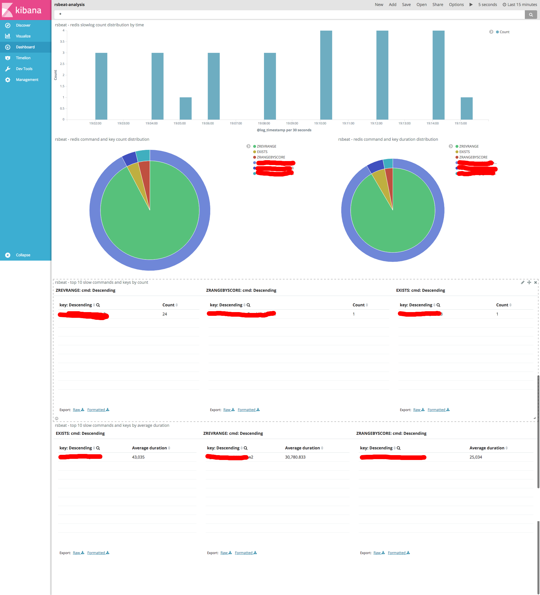

[](https://travis-ci.org/Yourdream/rsbeat)

Name
====
rsbeat - The Beat used to collect and analyze redis slow log.


Table of Contents
=================
* [Name](#name)
* [Status](#status)
* [Version](#version)
* [Requirements](#requirements)
* [Description](#description)
* [Usage](#usage)
    * [Install](#install)
    * [Config](#config)
    * [Run](#run)
    * [Docker](#docker)
* [Exported Fields](#exported-fields)
* [Kibana Dashboard](#kibana-dashboard)
* [Author](#author)

Status
======

Production ready.

Version
=======

The current version is 5.3.2.

Requirements
============
* [Golang](https://golang.org/dl/) 1.7
* ElasticStack 5.x

Description
===========
Rsbeat use `slowlog get` command to read slow log. The following image shows the key flow.


1. Rsbeat connects to every redis server and send the following commands.
```shell
config set slowlog-log-slower-than 20000 # tell redis to log all commands whose execution time exceeds this time in microseconds
config set slowlog-max-len 500 # tell redis to just record recent 500 slow logs
slowlog reset #tell redis to clear current slow log records
```
2. Rsbeat periodically pull slow log from redis.
3. Rsbeat publish all slow log events to elasticsearch.
4. User can analyze all slow log events through Kibana. Rsbeat has already provided a useful kibana dashboard which user can import directly to kibana.

[Back to TOC](#table-of-contents)


Usage
=====

Like the other beats, rsbeat is easy to use.

Install
=======
To build the binary for rsbeat run the command below. This will generate a binary in the same directory with the name rsbeat.

```bash
make
```

Alternatively, you can download the binary file from [release page](https://github.com/Yourdream/rsbeat/releases).

To run rsbeat with debugging output enabled, run:

```
./rsbeat -c rsbeat.yml -e -d "*"
```

[Back to TOC](#table-of-contents)


Config
======
Rsbeat has the following config fields.

```yaml
rsbeat:
  period: 1s 
  redis: ["192.168.33.10:6379"]
  slowerThan: 100 
```
* rsbeat.period: Defines how often an event is sent to the output.
* rsbeat.redis: Defines redis server list.
* rsbeat.slowerThan: Defines time in microseconds which is sent to redis server by command `config set slowlog-log-slower-than`.

[Back to TOC](#table-of-contents)

Run
===
Firstly, run rsbeat.

```
./rsbeat -c rsbeat.yml
```

Secondly, import kibana dashboard.

Enjoy your travel to redis slow log now!

[Back to TOC](#table-of-contents)

Docker
======
We use [docker-compose](https://docs.docker.com/compose/compose-file/compose-file-v2/) for our docker environment, so we have put a **docker-compose.yml** file under the project `docker` directory.

Usage is very simple.
 
First step: Start kibana
```
cd docker
docker-compose start kibana
```

Connect to `http://127.0.0.1:5601`, you should see kibana interface.

Second step: Download latest rsbeat and run rsbeat
```
cd docker
curl -fsSL 'https://github.com/Yourdream/rsbeat/releases/download/v5.3.2/rsbeat-linux-amd64' -o rsbeat-linux-amd64
docker-compose build rsbeat
docker-compose run -e "REDIS_LIST=\"10.0.0.40:6379\"" rsbeat
```

Now you should see logs in console output.

`REDIS_LIST` is the redis instance you wish to monitor. You can specify more instances like this `REDIS_LIST=\"10.0.0.40:6379\",\"10.0.0.21:6379\"`. But DO NOT USE `127.0.0.1` or `localhost` host because the docker container network archetecture cannot connect to service in host machine.

The other environment variables are as belows:

1. `PERIOD` defines how often an event is sent to the output. For example `-e "PERIOD=2s"`. The default value is `1s`.
2. `ES_URL` specify the elasticsearch url. For example `-e "ES_URL=10.0.0.20:9200"`. The default value is `elasticsearch:9200` which is the elasticsearch service in docker.
3. `REDIS_SLOWER_THAN` defines time in microseconds which is sent to redis server by command `config set slowlog-log-slower-than`. The default value is `100`.


Third step: Configure kibana

1. Add `rsbeat-*` index template to kibana and use `@log_timestamp` as the `Time-field name`.
2. Import rsbeat-dashboard.json in project root directory in kibana `Management` -> `Saved Objects` page.
3. Go to dashboard and choose `rsbeat-analysis`. 

Enjoy it!
Check about [docker-compose cli reference](https://docs.docker.com/compose/reference/overview/), [elasticsearch docker reference](https://www.elastic.co/guide/en/elasticsearch/reference/current/docker.html), [kibana docker reference](https://www.elastic.co/guide/en/kibana/current/docker.html) for more details.


[Back to TOC](#table-of-contents)

Exported Fields
=====
Following is the exported fields.

```json
{
    "@timestamp": "2017-04-24T04:51:59.000Z",
    "slowId": 717,
    "cmd": "SADD",
    "key": "pushUserId",
    "args": [
      "dfd60b06de3b102afcdcad12sad"
    ],
    "duration": 928,
    "ipPort": "127.0.0.1:6379",
    "extraTime": "2017-04-24T04:51:59Z",
    "beat": {
      "hostname": "localhost",
      "name": "localhost",
      "version": "5.1.3"
    },
    "type": "rsbeat"
  }
```

Compare to redis `slowlog get` output fields:

```
redis 127.0.0.1:6379> slowlog get
1)  1) (integer) 717
    2) (integer) 1493009519
    3) (integer) 928
    4) 1) "SADD"
       2) "pushUserId"
       3) "dfd60b06de3b102afcdcad12sad"

```

Every entry is composed of four fields coresponding to rsbeat exported fields:
* `slowId`: A unique progressive identifier for every slow log entry.
* `extraTime`: The unix timestamp at which the logged command was processed.
* `duration`: The amount of time needed for its execution, in microseconds.
* `cmd` `key` `args`: The array composing the arguments of the command.

[Back to TOC](#table-of-contents)

Kibana Dashboard
================
Rsbeat has a prebuilt dashboard for you to analyze your slow log quickly.
 
 
 Go to Kibana Management Menu and import `rsbeat-dashboard.json` to `Saved Objects`.

[Back to TOC](#table-of-contents)

Author
======
* [Lau](https://github.com/liugaohua)
* [Leon J](https://github.com/jyj1993126)
* [Rockybean](https://github.com/rockybean)

